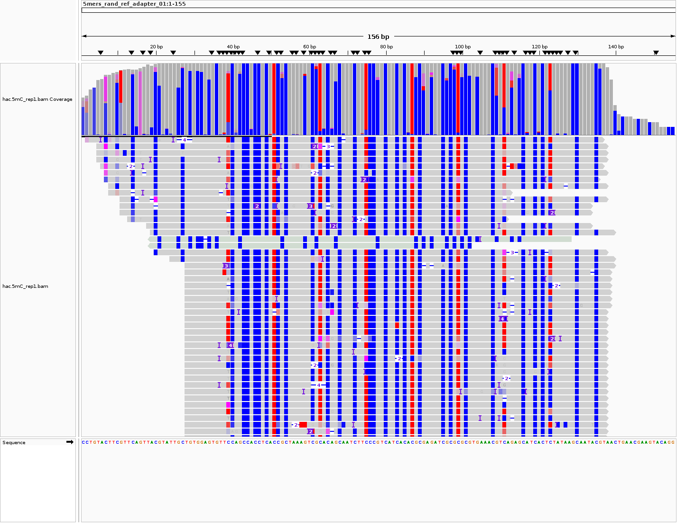

.. |Green-boxts| raw:: html

    

    <h1>
.. |Orange-boxts| raw:: html

    

    <h1>

.. |boxs| raw:: html

    </h1>

.. |boxe| raw:: html

    

========================================================
DNA Methylation: Oxford Nanopore Data Processing Workflow
========================================================

:raw-html:` `

**Learning Outcomes**

In this tutorial, you will learn how to process raw files from ONT sequencing from basecalling, mapping to generating a QC report.  You will also learn how to visualise modified base calls in IGV and generate summary counts of modified and unmodified bases using Modkit.  If there is time, you will also learn how to use Nextflow to launch pre-packaged reproducible workflows for ONT data analysis.

:raw-html:` `

.. Contents
.. ========

.. contents:: 
    :local:

:raw-html:` `
:raw-html:` `

Introduction
------------

Oxford Nanopore Technologies (ONT) sequencing platform is capable of detecting DNA modifications such as 5-methylcytosine (5mC), 5-hydroxymethylcytosine (5hmC), and 6-methyladenine (6mA) directly from native DNA without the need for chemical conversion or affinity purification.  This is achieved by training machine learning models to recognize the altered electrical signals produced when modified bases pass through the nanopore during sequencing.  In this tutorial, we will explore how to perform basecalling and modified base detection using ONT's Dorado software, followed by quality control and visualization of the results.

:raw-html:` `
:raw-html:` `

Connect to Pelle
----------------

We have booked 5 CPU and 1 GPU cores on Pelle per course participant. 
For this tutorial, you will not be needing an interactive session.
Instead you will be submitting jobs to the SLURM queue system.

Open a terminal and log in to Pelle.  Note that in Pelle, you will have to login using 2-factor authentication (2FA).

.. code-block:: bash

   ssh -Y <username>@pelle.uppmax.uu.se

:raw-html:` `
:raw-html:` `

Set up your working directory
----------------------------------

Change directory to the course directory 

.. code-block:: bash

   cd /proj/uppmax2025-2-309/nobackup/ngi-epigenomics/students/

, and create your personal folder with name ``<your_name>``.

.. code-block:: bash

   mkdir <your_name>

Create sub folders to tidy files in your personal folder, replace ``<your_name>`` with your name in the commands below.

.. code-block:: bash

   mkdir <your_name>/scripts  #folder to store your codes
   mkdir <your_name>/data     #folder to store data
   mkdir <your_name>/output   #folder to store output files generated after running your codes

Instead of copying data files, you will generate softlinks of ONT data to your personal folder.
Soft links, or symbolic links, are special files that act as shortcuts to another file or directory by storing a path to the original location.

.. code-block:: bash

   cd data 
   ln -s /proj/uppmax2025-2-309/nobackup/ngi-epigenomics/data/modbase-validation_2024.10 modbase-validation_2024.10
   cd ../

Copy source codes.  You will need to edit your local copy of the codes later.

.. code-block:: bash

   cp /proj/uppmax2025-2-309/nobackup/ngi-epigenomics/scripts/* scripts/.

:raw-html:` `
:raw-html:` `

The dataset
-------------

The `ONT sample data set <https://epi2me.nanoporetech.com/mod-validation-data/>`_ is derived from synthetic oligonucleotides and sequenced on a PromethION-24 device.  Each data contains canonical (unmodified) or modified bases within all distinct 5-mer sequence contexts.  The raw pod5 files are available from a “full” dataset and a “subset” dataset.  The subset dataset was produced from the aligned full dataset by randomly selecting 5,000 reads per synthetic construct. For this workshop, we will use the subset data set to quickly reproduce results.  The corresponding bam files generated with the SUP basecalling model are also available to allow you to inspect modified base calls without the need to run the basecalling step.

The data directory structure is as follows:

 .. code-block:: bash

         └── modbase-validation_2024.10
            ├── basecalls
            │   ├── 5hmC_rep1.bam
            │   ├── 5hmC_rep2.bam
            │   ├── 5mC_rep1.bam
            │   ├── 5mC_rep2.bam
            │   ├── 6mA_rep1.bam
            │   ├── 6mA_rep2.bam
            │   ├── control_rep1.bam
            │   └── control_rep2.bam
            ├── README
            ├── references
            │   ├── all_5mers_5hmC_sites.bed
            │   ├── all_5mers_5mC_sites.bed
            │   ├── all_5mers_6mA_sites.bed
            │   ├── all_5mers_A_sites.bed
            │   ├── all_5mers_C_sites.bed
            │   └── all_5mers.fa
            └── subset
               ├── 5hmC_rep1.pod5
               ├── 5hmC_rep2.pod5
               ├── 5mC_rep1.pod5
               ├── 5mC_rep2.pod5
               ├── 6mA_rep1.pod5
               ├── 6mA_rep2.pod5
               ├── control_rep1.pod5
               └── control_rep2.pod5

This tutorial uses two open source tools available on GitHub: ``Dorado`` for basecalling, including modified base calling, and ``Modkit`` for summary counts of modified and unmodified bases. Both are command-line tools from Oxford Nanopore Technologies. 

:raw-html:` `
:raw-html:` `

Basecalling using `Dorado <https://github.com/nanoporetech/dorado>`_
----------------------------------------------------------------

Load the latest version of ``dorado`` module in Pelle.

 .. code-block:: bash

   module load dorado

To see all the available options and their default values in ``dorado``, run
 
 .. code-block:: bash

   dorado -h 
   dorado <subcommand> -h
   dorado basecaller -h

By default, ``dorado basecaller`` will attempt to detect any adapter or primer sequences at the beginning and end of reads, and remove them from the output sequence.

.. admonition:: Question
   :class: warning

    What is the argument when invoking ``dorado basecaller`` if you want to skip read trimming?

We will write a bash script that will execute ``dorado`` command and submit this script to the SLURM queue system.  The job submission script will include a number of SLURM directives prefixed with ``#SBATCH``.  Have a look at each of the ``#SBATCH``  directives and their meanings.

.. admonition:: Job script
   :class: dropdown, note

   .. code-block:: bash

      #!/bin/bash -l                          # Tells the shell that the script should be interpreted and executed by 'bash'
      #SBATCH -A uppmax2025-2-309             # Replace with your NAISS project name
      #SBATCH -p gpu                          # Request a GPU partition or node
      #SBATCH --gres=gpu:1                    # Request generic resources  of 1 gpu
      #SBATCH -t 24:00:00                     # Set a limit of the total run time, format is days-hours:minutes:seconds
      #SBATCH -J DORADO                       # Specifies name for the job
      #SBATCH -e DORADO_%j_error.txt          # output file for the bash script standard error
      #SBATCH -o DORADO_%j_out.txt            # output file for the bash script standard output

      # load dorado -  latest version
      module load dorado
      #
      # load modkit -  latest version
      module load modkit
      #
      # location of a precompiled pycoQC binary
      pycoQC="/home/louel/.conda/envs/pycoQC/bin/pycoQC"
      #
      # load samtools - latest version
      module load SAMtools

      # input raw POD5 file. CHANGE to your project folder!
      inpod5="/proj/uppmax2025-2-309/nobackup/ngi-epigenomics/students/louella/data/modbase-validation_2024.10/subset/5mC_rep1.pod5"
      #
      # reference genome in fasta format.  CHANGE to your project folder!
      reffasta="/proj/uppmax2025-2-309/nobackup/ngi-epigenomics/students/louella/data/modbase-validation_2024.10/references/all_5mers.fa"

      # specify the output directory to store the output files.  CHANGE to your project folder!
      outputdir=/proj/uppmax2025-2-309/nobackup/ngi-epigenomics/students/louella/output
      #
      # specify the output filename
      outputbam=$(echo $inpod5 | xargs basename -s .pod5)
      outputbam="hac.$outputbam"
      echo "Saving output file to .... $outputbam"
      echo
      sleep 3s

      #
      #
      # 1.
      # run dorado basecaller command
      # output is unaligned BAM file
      dorado basecaller hac,5mC_5hmC $inpod5 > $outputdir/$outputbam.unaligned.bam

      # run dorado basecaller command and align reads to the reference genome
      # output is aligned BAM file
      dorado basecaller hac,5mC_5hmC $inpod5 --reference $reffasta > $outputdir/$outputbam.bam
      #
      # sort bam by coordinates then index
      samtools sort $outputdir/$outputbam.bam > $outputdir/tmp.$outputbam.bam
      mv $outputdir/tmp.$outputbam.bam $outputdir/$outputbam.bam
      samtools index $outputdir/$outputbam.bam

      #
      #
      # 2. 
      # outputs read level sequencing information from the BAM file
      dorado summary $outputdir/$outputbam.bam > $outputdir/$outputbam.summary.tsv

Dorado supports both CPUs and GPUs, but using GPUs is essential for practical runtime.  In the script, we have requested to use one GPU core.  The job should finish in a few minutes, in contrast to several hours in CPU mode.

.. admonition:: Question
   :class: warning

   What is the maximum limit of run time  that you have set in running this job?

.. Insert batch script here

The texts that start with ``#`` except in ``#SBATCH`` and ``#!/bin/bash`` are just comments that usually describe what a certain line of code does.
Hence, these comments will be ingored when the script is executed.

| Now, you can make edits to the source code by using the unix editor ``nano``.
| Remember to use ``Ctrl+O`` to save, ``Ctrl+X`` to exit.

.. code-block:: bash

   cd scripts
   nano run.dorado.gpu.Pelle.sh 

| Replace louella with ``<your_name>`` in variables ``inpod5``, ``reffasta`` and ``outputdir``.
| ``Ctrl+O`` and ``Enter`` to save your changes.

Note that for aligning reads to a reference sequence after basecalling, dorado uses ``minimap2`` aligner.

.. admonition:: Question
   :class: warning
   
   What is the argument when invoking ``dorado basecaller`` if you want to proceed to read alignment?

In addition, we specified in ``dorado basecaller`` that we want to use ``hac`` and ``5mc_5hmC`` for base calling and modified basecalling models respectively.  There are 3 models available namely ``fast``, ``hac`` (high-accuracy), and ``sup`` (super-accurate). These are in order of increasing basecalling accuracy where ``fast`` is the least accurate and ``sup`` is the most accurate, and generally in increasing computing time with ``sup`` being the most computationally expensive.  The Dorado developers recommend the ``hac`` model for most users as it strikes the best balance between accuracy and computational cost.

| When specifying the model in the dorado command such as ``hac``, it will use the latest compatible ``hac`` model.
| If you want to use a specific model version then use this naming format
| ``{analyte}_{pore type}_{kit chemistry}_{translocation speed}_{model type}@version``, e.g.,
| ``dna_r10.4.1_e8.2_400bps_sup@v5.2.0``.  For more info about Dorado models, please see `here  <https://software-docs.nanoporetech.com/dorado/latest/models/list>`_.

Dorado also supports modified base calling.  Modified bases are modifications to one of the canonical bases (ACGT).  See table below for a list of supported DNA modified bases.    Modified base models can be either all-context or motif-specific.  For example, given the sequence ACGTCA the 5mC all-context model will predict at all C bases i.e., aCgtCa.  On the other hand, the 5mCG model will return predictions at only CG motif i.e., aCgtca.  Furthermore, you can define a space separated list of modified base codes from these choices: 6mA, 5mC, 5mCG,  5mC_5hmC, 5mCG_5hmCG, 4mC_5mC.  

=====     ========================     =====
Mod       Name                         SAM Code
=====     ========================     =====
5mC       5-Methylcytosine             C+m
5hmC      5-Hydroxymethylcytosine      C+h
4mC       N(4)-methylcytosine          C+21839
6mA       6-Methyladenine              A+a
=====     ========================     =====

*Table 1: DNA modifications supported in Dorado*

.. admonition:: Question
   :class: warning

   What does this command do? 
   
    .. code-block:: bash

      dorado basecaller hac,6mA,5mCG_5hmCG file.pod5

The default output of dorado is an unaligned BAM, and if alignment is enabled then the BAM contains alignment information too.  This BAM can then be used to generate a summary of the whole dataset using ``dorado summary`` command.  This command outputs a tab-separated file with read level sequencing information from the BAM file.

.. admonition:: Question
   :class: warning

   In running ``dorado basecaller``, how would you specify that you want the output file format to be in FASTQ?

:raw-html:` `
:raw-html:` `

Submitting a job
----------------------------------

After all the lengthy explanation above, you now have understood what the bash script will do and some important information and options in running ``dorado basecaller``.  Now you are ready to submit this job script. 

| ``Ctrl+X`` to exit nano.
| To submit the job, type the command below in the terminal.

.. code-block:: bash

   sbatch run.dorado.gpu.Pelle.sh 

| To check on the status of your job in the queue:  
| note that ``username`` is your UPPMAX login name.
.. code-block:: bash

   squeue -u username

.. code-block:: bash

   JOBID PARTITION     NAME         USER     ST       TIME  NODES NODELIST(REASON)
   5104668             gpu DORADO   username PD       0:00      1 (Priority)

Here we can see in the status column (ST) that the job is pending (PD) and has not started yet. The job is waiting for a node to become available. When the job starts, the status will change to R (running).

To cancel a job,

.. code-block:: bash

   scancel <job id>

You can see the ``job id`` in the output from ``squeue``.

.. code-block:: bash

   scancel 5104668

Dorado will generate some runtime information (logging) which is written to stderr or standard error.
In the script, you will find a code line with  ``#SBATCH -e DORADO_%j_error.txt``.
This means that after your job has finished running, any generated runtime messages will be saved to a log file with filename ``DORADO_%j_error.txt``, where ``%j`` is the job id.  

To view the content of this file,

.. code-block:: bash

   less -S DORADO_%j_error.txt

| Now, let us quickly check the count alignment statistics of the bam files generated by your script.
| The command below returns your current location, you should be in the script folder ``<your_name>/scripts``.

.. code-block:: bash

   pwd

Change directory to your output folder.

.. code-block:: bash

   cd ../output

List all files in the current directory with file extension ``.bam``.

.. code-block:: bash

   ls *.bam

Load the pre-installed latest version of ``samtools`` in Pelle.

.. code-block:: bash

   module load SAMtools

Generate alignment summary statistics.

.. code-block:: bash

   samtools flagstat hac.5mC_rep1.unaligned.bam
   samtools flagstat hac.5mC_rep1.bam

.. admonition:: Question
   :class: warning

   What is the mapping rate of each bam file?

.. samtools view
.. Explain BAM https://davetang.org/wiki/tiki-index.php?page=SAM
.. SAM tags MM / ML
.. ML B,C Base modification probabilities 
.. MM Z Base modifications / methylation MN i Length of sequence at the time MM and ML were produced

.. admonition:: Exercise:
   :class: example

   | Run ``dorado basecaller`` with ``sup`` model.
   | Make sure you change all the relevant output files, 
   | e.g., change to 
   | ``outputbam="sup.$outputbam"``
   

.. admonition:: Question
   :class: warning

   Did the use of the ``sup`` model increase the mapping rate of the output BAM? 

:raw-html:` `
:raw-html:` `

pycoQC
----------------------------------

We can use the software `pycoQC <https://a-slide.github.io/pycoQC/>`_ to generate interactive QC plots.  This tool has been developed specifically for ONT sequencing data.  It requires a sequencing summary file ``summary.tsv`` that is generated by the command ``dorado summary``.

The minimal usage is 

.. code-block:: bash

   pycoQC -f /path/to/summary.tsv -o /path/to/output.html

.. admonition:: Exercise:
   :class: example

   | Add a pycoQC run in step 3 of the bash script ``run.dorado.gpu.Pelle.sh`` 
   | and submit the job again.
   | Use the command below which will include alignment information from an input BAM file.
   | ``$pycoQC -f /path/to/summary.tsv -a /path/to/input.bam -o /path/to/output.html``
   | Please edit the file path and name in the script accordingly.

Download the html report to your laptop.
Open a terminal and change to the desired directory, i.e., ``cd /path/to/myfolder``,
then use the ``scp`` command to transfer files.

.. code-block:: bash

   scp <your_uppmax_username>@pelle.uppmax.uu.se:/proj/uppmax2025-2-309/nobackup/ngi-epigenomics/students/<your_name>/output/hac.5mC_rep1.html .

View the html report with a web browser.

.. admonition:: Question
   :class: warning

   | How many reads do you have in total?
   | What are the median, minimum and maximum read lengths?

:raw-html:` `
:raw-html:` `

IGV
----------------------------------

IGV is a genome browser that allows you to visualize read mapping.
You can enable a coloring scheme that is designed to create visualizations of alignments with modified bases specified with ``MM`` and ``ML`` tags in the BAM file,  denoting modification type and likelihood respectively (see the `Sam Tags <https://samtools.github.io/hts-specs/SAMtags.pdf>`_ specification).  While designed for visualization of 5mC, it can be used to visualize any modification. 

| In this scheme, the  color for modified bases is assigned based on the probability of the modification. Specifically:
| base modifications with probability < 50% are colored blue,
| base modifications with probability > 50% are colored red for 5mc, magenta for 5hmC.
| Please refer `here <https://igv.org/doc/desktop/#UserGuide/tracks/alignments/base_modifications/>`_ for the  full description of this IGV functionality.

.. admonition:: Exercise:
   :class: example

   Download a BAM file and its index  to your laptop.

   .. code-block:: bash

      scp <your_uppmax_username>@pelle.uppmax.uu.se:/proj/uppmax2025-2-309/nobackup/ngi-epigenomics/students/<your_name>/output/*.bam* .

   Download the reference sequence FASTA file and its index to your laptop.
   
   .. code-block:: bash

      scp <your_uppmax_username>@pelle.uppmax.uu.se:/proj/uppmax2025-2-309/nobackup/ngi-epigenomics/students/<your_name>/data/modbase-validation_2024.10/references/*.fa* .

   | Start the IGV application.
   | Load the reference FASTA file.  Select ``Genomes > Load Genome from File``.
   | Load BAM file.  Select ``File > Load from File``.
   | Select one chromosome, e.g., ``5mers_rand_ref_adapter_01``.  
   | Right click on the BAM track and select ``Color alignments by > base modification 2-color (all)``.
   | You should see a similar IGV session as below.

*Fig. 1: IGV snapshot for chromosome ``5mers_rand_ref_adapter_01``*

.. admonition:: Question
   :class: warning

   What kind of information is shown by the coverage track?

:raw-html:` `
:raw-html:` `

Summarise counts using `Modkit <https://nanoporetech.github.io/modkit/>`_
-----------------------------------------------------------------------------

After  modified base calling is done, one can aggregate read counts for each base modification across genomic position.  This can be done by executing the ``modkit pileup`` command.  
Modkit will then create a table in an extended `bedMethyl  <https://www.encodeproject.org/data-standards/wgbs/>`_ format that  will tabulate the summary counts of modified and unmodified bases at a genomic position. 

Load the latest version of ``modkit`` module in Pelle.

 .. code-block:: bash

   module load modkit

To see all the available options and their default values in ``modkit``, run
 
 .. code-block:: bash

   modkit -h 
   modkit <subcommand> -h
   modkit pileup -h

The basic syntax is 

.. code-block:: bash

   modkit pileup [OPTIONS]  <IN_BAM> <OUT_BED>

The input ``<IN_BAM>`` is an aligned basecalled BAM generated by ``dorado basecaller`` (i.e., also called a  modBAM).  Note that ``modkit`` requires that the input modBAM is sorted by genomic position and indexed.  To sort by position, use ``samtools sort <IN_BAM>``.  To index a BAM file, use ``samtools index <IN_BAM>``.

The output ``<OUT_BED>`` of a ``modkit pileup`` is a bedMethyl table as described in detail `here <https://nanoporetech.github.io/modkit/intro_pileup.html#bedmethyl-column-descriptions>`_.
By default, ``modkit`` will output a BED row for all genomic positions where there is at least one base modification in the input modBAM. 

Modkit uses single-letter codes for common modified bases.  This code will be written out in column 4 of the bedMethyl table.

| Examples of modified base codes:
| m: 5-methylcytosine (5mC)
| h: 5-hydroxymethylcytosine (5hmC)
| a: N(6)-methyladenosine (m6A)

Now I will run ``modkit pileup`` on ``5mC_rep1.bam``.  Note that ``modkit`` requires a reference sequence ``--ref`` whenever ``--cpg`` is invoked.  The path ``/path/to/`` is arbitrary, you can replace this with the correct location of the relevant file in your personal folder.

.. code-block:: bash

   modkit pileup /path/to/5mC_rep1.bam pileup.bed --log-filepath pileup.log --ref /path/to/all_5mers.fa --cpg --threads 8

From the output of ``pileup.bed``,  I am only selecting the rows corresponding to position ``5mers_rand_ref_adapter_01     86    87``.  Furthemore, I am only showing columns ``4,6,10,11,12,13,14-18``.  

.. code-block:: bash

   cat pileup.bed | awk '$1=="5mers_rand_ref_adapter_01" && $2==86' |  cut -f4,6,10,11,12,13,14-

========  ======  ==========  =====  =====  ==========  ==========  ========  ======  =====  ========
Mod base  strand  Nvalid_cov  %mod   Nmod   Ncanonical  Nother_mod  Ndelete   Nfail   Ndiff   Nnocall
========  ======  ==========  =====  =====  ==========  ==========  ========  ======  =====  ========
a           +        22       13.64     3       19            0        13       82     4874      0
h           +      4851        0.41    20       22         4809        13       82       45      0  
m           +      4851       99.13  4809       22           20        13       82       45      0
========  ======  ==========  =====  =====  ==========  ==========  ========  ======  =====  ========
*Table 2: Example bedMethly output generated by modkit*

.. admonition:: Question
   :class: warning

   | What does each row represent?
   |
   | What is the most likely base modification call for this nucleotide? 
   | And how many reads support each of the modified and canonical bases?
   |
   | What is the argument  ``--log-filepath`` for?

The command above has invoked the optional argument of ``--cpg`` which will only summarise counts at CpG motifs.  Generally, you can specify the sequence motif on which to tally the read counts by using ``--motif <Motif> <offset, 0-based>``.   For example,  the argument ``---motif GATC 1`` will  pileup counts for the A in the second position on the top strand and the A in the third position on the bottom strand.
The ``--cpg`` argument is shorthand for ``--motif CG 0``, i.e., to pileup counts for the first C in the motif on the top strand and the second C (complement to G) on the bottom strand. 

You can also use ``--combine-strands`` to sum the counts from both strands, and ``--combine-mods`` to combine the counts from all modified bases.

.. admonition:: Exercise:
   :class: example

   | Add a ``modkit pileup`` run in step 4 of the bash script ``run.dorado.gpu.Pelle.sh`` 
   | and submit the job again.
   | Use the command below with option ``--preset traditional`` which is equivalent to
   | ``--cpg --ref <reference.fasta> --ignore h --combine-strands``.
   | Please edit the file path and name in the script accordingly.

   NB: The backlash ``\`` is used to split a long command into multiple lines for better readability.

   .. code-block:: bash

      modkit pileup path/to/5mC_rep1.bam output/path/pileup.bed \
      --ref path/to/reference.fasta \
      --preset traditional
      --log-filepath output/path/pileup.log

.. admonition:: Question
   :class: warning

   
   What does ``--ignore h`` do ?

:raw-html:` `
:raw-html:` `

Modkit extras
--------------

Modkit has a suite of tools for processing and analyzing modified base calls in modBAM files.  Here are two more functionality that you may find useful.
We do not have the time to discuss them in this workshop.  However, if you are interested, please visit the Modkit documentation for example usage and more details.

`Modkit repair <https://nanoporetech.github.io/modkit/intro_repair.html>`_

The ``modkit repair`` command is useful when you have a BAM with reads where the canonical sequences have been altered in some way that either renders the ``MM`` and ``ML`` tags invalid.  An example case is the BAM has been trimmed or hard-clipped.  The ``modkit repair`` command will fix the ``MM`` and ``ML`` tags to be consistent with the canonical sequence in the BAM file.

`Modkit DMRs <https://nanoporetech.github.io/modkit/dmr_scoring_details.html>`_

You can use the command ``modkit dmr`` to perform differential methylation analysis between two haplotypes (allele-specific change) or between two groups.  
Haplotype-level DMR analysis focuses on individual haplotypes, e.g.,  maternal vs paternal haplotypes. 
Population-scale DMR analysis takes population groups (e.g., case/control cohorts) and  identifies methylation differences between entire groups.

:raw-html:` `
:raw-html:` `

Alternative workflows
---------------------

We present here alternative workflows built using Nextflow that are pre-packaged and reproducible pipelines to analyze Oxford Nanopore sequencing data.  These workflows automate complex tasks like alignment, count pileup, and finding DMRs.

For a tutorial about the basics of Nextflows and launching of nf-core pipelines in HPC, please see `here <https://ngi-nbis-epigenomics-hands-on.readthedocs.io/en/latest/content/tutorials/nextflow/nextflow.html>`_.

:raw-html:` `

**EPI2ME wf-basecalling**

EPI2ME Labs maintains a collection of Nextflow bioinformatics workflows tailored to ONT data. 
Here we only present the workflow for basecalling.
For a full description of this workflow, please visit `here <https://epi2me.nanoporetech.com/epi2me-docs/workflows/wf-basecalling/>`_.

| This workflow can be used to perform:
| (Modified) Basecalling of a directory of pod5 or fast5 signal data using ``dorado basecaller``
| Output format can be FASTQ, CRAM or Unaligned BAM
| If a reference is provided, dorado will perform alignment using minimap2

Change directory to your personal folder.

.. code-block:: bash

   cd /proj/uppmax2025-2-309/nobackup/ngi-epigenomics/students/<your_name>

A demo dataset is provided by EPI2ME for testing the workflow.  The POD5 dataset is a subset of the January 2025 GIAB HG002 Dataset used for testing the EPI2ME wf-basecalling pipeline.

| Generate softlinks of the demo data to your personal folder.

.. code-block:: bash

   cd data 
   ln -s /proj/uppmax2025-2-309/nobackup/ngi-epigenomics/data/wf-basecalling-demo wf-basecalling-demo 
   cd ../

Edit your local copy of the script ``run.epi2me.basecall.sh``.

.. code-block:: bash

   cd script
   nano run.epi2me.basecall.sh

.. admonition:: Job script
   :class: dropdown, note

   .. code-block:: bash

      #!/bin/bash -l

      #SBATCH -A uppmax2025-2-309             # Replace with your NAISS project name
      #SBATCH -p gpu                          # Request a GPU partition or node
      #SBATCH --gres=gpu:1                    # Request generic resources  of 1 gpu
      #SBATCH --ntasks 16                     # Request this number of threads
      #SBATCH -t 12:00:00                     # Set a limit of the total run time
      #SBATCH -J EPI2ME                       # Specifies name for the job
      #SBATCH -e EPI2ME_%j_error.txt          # output file for the bash script standard error
      #SBATCH -o EPI2ME_%j_out.txt            # output file for the bash script standard output

      # Load the preinstalled latest Nextflow
      module load Nextflow

      # set your personal directory
      mydir="/proj/uppmax2025-2-309/nobackup/ngi-epigenomics/students/louella"

      # Set Apptainer/Singularity environment variables to define caching and tmp
      # directories. These are used during the conversion of Docker images to
      # Apptainer/Singularity ones.
      # These lines can be omitted if the variables are already set in your `~/.bashrc` file.
      #
      # create directory
      mkdir -p $mydir/apptainer/cache
      mkdir -p $mydir/apptainer/tmp
      #
      export APPTAINER_CACHEDIR="$mydir/apptainer/cache"
      export APPTAINER_TMPDIR="$mydir/apptainer/tmp"

      # output folder
      OUTPUT="$mydir/output/TEST_EPI2ME"
      # create directory
      mkdir -p $OUTPUT

      # directory containing all pod5 files
      inpod5="$mydir/data/wf-basecalling-demo/input_1"
      # reference sequence FASTA file
      reffasta="$mydir/data/wf-basecalling-demo/GCA_000001405.15_GRCh38_no_alt_analysis_set.fasta"

      # launch nextflow process
      nextflow run epi2me-labs/wf-basecalling \
         --basecaller_cfg 'dna_r10.4.1_e8.2_400bps_hac@v5.2.0' \             # name of the model for basecalling
         --remora_cfg 'dna_r10.4.1_e8.2_400bps_hac@v5.2.0_5mCG_5hmCG@v1' \   # name of the model for modified basecalling
         --dorado_ext 'pod5' \                                               # file extension for Dorado inputs
         --input $inpod5 \
         --ref $reffasta \
         -profile singularity \
         --out_dir $OUTPUT

| Replace ``louella`` with ``<your_name>`` in variable ``mydir``.
| ``Ctrl+O`` and ``Enter`` to save your changes.
| ``Ctrl+X`` to exit nano.

To submit the job, type the command below in the terminal.

.. code-block:: bash

   sbatch run.epi2me.basecall.sh

| To check on the status of your job in the queue:  
| note that ``username`` is your UPPMAX login name.

.. code-block:: bash

   squeue -u username

The example run of EPI2ME wf-basecalling in the job script will generate CRAM files that can be found in your output directory $OUTPUT.

.. admonition:: Output files generated
   :class: dropdown, note

   .. code-block:: bash

      ├── execution
      │   ├── report.html
      │   ├── timeline.html
      │   └── trace.txt
      ├── SAMPLE.fail.cram
      ├── SAMPLE.fail.cram.crai
      ├── SAMPLE.pass.cram
      ├── SAMPLE.pass.cram.crai
      └── wf-basecalling-report.html

:raw-html:` `

**nf-core methylong**

The nf-core/methylong is an end-to-end comprehensive pipeline that is tailored for long-read methylation calling.  The user has an option to either run the ONT or the PacBio HiFi workflows.  Here we only present the ONT workflow.  Full documentation is `here <https://nf-co.re/methylong/dev/>`_. 

Note that we will be using the version ``dev``, which is still under active development and has not been deployed for production release.  Hence,  it is not uncommon to encounter bugs when running this pipeline version.  We are already testing the ``dev`` version as it has more functionality than the latest release ``1.0.0``.

The ONT workflow can be used to perform:

* (Modified) basecalling using ``dorado basecaller``
* trim (``porechop``) and repair tags (``modkit repair``) of input modBAM 

* align to reference using ``minimap2``
   optional: If input is an aligned modBAM then use argument ``--reset``  to remove previous alignment information before running read alignment.

* create bedMethyl table using ``modkit pileup``
* create bedgraphs for visualisation (optional)
* SNV calling using ``clair3``
* SNV phasing using ``whatshap phase``

* DMR analysis using ``DSS`` (default) or ``modkit dmr``
   includes DMR haplotype level and population scale 

You can use this premade sample sheet ``samplesheet.dev.csv`` in your ``\script`` folder which uses some POD5 files from the dataset ``modbase-validation_2024.10``.

Change directory to your personal folder.

.. code-block:: bash

   cd /proj/uppmax2025-2-309/nobackup/ngi-epigenomics/students/<your_name>

Edit your local copy of the script ``run.nfcore.methylong.Pelle.sh``.

.. code-block:: bash

   cd script
   nano run.nfcore.methylong.Pelle.sh

.. admonition:: Job script
   :class: dropdown, note

   .. code-block:: bash

      #!/bin/bash -l

      #SBATCH -A uppmax2025-2-309             # Replace with your NAISS project name
      #SBATCH -p gpu                          # Request a GPU partition or node
      #SBATCH --gres=gpu:1                    # Request generic resources  of 1 gpu
      #SBATCH --ntasks 16                     # Request this number of threads
      #SBATCH -t 48:00:00                     # Set a limit of the total run time
      #SBATCH -J methylong                    # Specifies name for the job
      #SBATCH -e methylong_%j_error.txt       # output file for the bash script standard error
      #SBATCH -o methylong_%j_out.txt         # output file for the bash script standard output

      # Load the preinstalled latest Nextflow
      module load Nextflow

      # set your personal directory
      mydir="/proj/uppmax2025-2-309/nobackup/ngi-epigenomics/students/louella"

      # Set Apptainer/Singularity environment variables to define caching and tmp
      # directories. These are used during the conversion of Docker images to
      # Apptainer/Singularity ones.
      # These lines can be omitted if the variables are already set in your `~/.bashrc` file.
      #
      # create directory
      mkdir -p $mydir/apptainer/cache
      mkdir -p $mydir/apptainer/tmp
      #
      export APPTAINER_CACHEDIR="$mydir/apptainer/cache"
      export APPTAINER_TMPDIR="$mydir/apptainer/tmp"

      # output folder
      OUTPUT="$mydir/output/TEST_METHYLONG"
      # create directory
      mkdir -p $OUTPUT

      # launch nextflow process
      nextflow run nf-core/methylong -r dev \  # specify to use the version dev
      -profile uppmax \                        # use a config that is pre-configured in nf-core with a setup suitable for the UPPMAX clusters
      --input samplesheet.dev.csv \
      --outdir $OUTPUT \
      --project uppmax2025-2-309 \
      --bedgraph \                            # generate output bedgraph for visualisation
      --skip_snvs \                           # skip snvcall and phasing
      --dmr_population_scale \                # perform DMR analysis for population scale
      --population_dmrer modkit \             # use modkit for DMR analysis
      --dmr_a 5mc --dmr_b ctrl \              # define the group of DMR analysis in population scale
      --dorado_model hac \
      --dorado_modification 5mCG_5hmCG \
      -c local.config                         # use a user defined configuration setting to change default parameters of the pipeline

| Replace ``louella`` with ``<your_name>`` in variable ``mydir``.
| ``Ctrl+O`` and ``Enter`` to save your changes.
| ``Ctrl+X`` to exit nano.

Have a look at the provided sample sheet by using this command.

.. code-block:: bash

   less -S samplesheet.dev.csv

To submit the job, type the command below in the terminal.

.. code-block:: bash
   
   sbatch run.nfcore.methylong.Pelle.sh

| To check on the status of your job in the queue:  
| note that ``username`` is your UPPMAX login name.

.. code-block:: bash

   squeue -u username

The example run of nf-core methylong  in the job script  will take around 2.5 hours to finish. 
It will generate a large number of files stored in the output directory ``$OUTPUT``.

.. admonition:: Output files generated
   :class: dropdown, note

   .. code-block:: bash

      ├── multiqc
      │   ├── multiqc_data
      │   │   ├── multiqc_citations.txt
      │   │   ├── multiqc_data.json
      │   │   ├── multiqc_general_stats.txt
      │   │   ├── multiqc.log
      │   │   ├── multiqc_samtools_flagstat.txt
      │   │   ├── multiqc_software_versions.txt
      │   │   ├── multiqc_sources.txt
      │   │   └── samtools-flagstat-dp.txt
      │   ├── multiqc_plots
      │   │   ├── pdf
      │   │   │   ├── general_stats_table.pdf
      │   │   │   └── samtools-flagstat-dp.pdf
      │   │   ├── png
      │   │   │   ├── general_stats_table.png
      │   │   │   └── samtools-flagstat-dp.png
      │   │   └── svg
      │   │       ├── general_stats_table.svg
      │   │       └── samtools-flagstat-dp.svg
      │   └── multiqc_report.html
      ├── ont
      │   ├── 5mc&ctrl
      │   │   └── dmr_population_scale
      │   │       └── modkit
      │   │           └── 5mc&ctrl_modkit_dmr_population_scale.bed
      │   ├── 5mc-rep1
      │   │   ├── alignment
      │   │   │   ├── 5mc-rep1
      │   │   │   │   ├── 5mc-rep1_repaired.bam
      │   │   │   │   └── 5mc-rep1_repaired.bam.bai
      │   │   │   └── flagstat
      │   │   │       └── 5mc-rep1_ont.flagstat
      │   │   ├── basecall
      │   │   │   └── 5mc-rep1_calls.bam
      │   │   ├── bedgraphs
      │   │   │   ├── 5mc-rep1_A_negative.bedgraph.gz
      │   │   │   ├── 5mc-rep1_A_positive.bedgraph.gz
      │   │   │   ├── 5mc-rep1_CG_negative.bedgraph.gz
      │   │   │   ├── 5mc-rep1_CG_positive.bedgraph.gz
      │   │   │   ├── 5mc-rep1_CHG_negative.bedgraph.gz
      │   │   │   ├── 5mc-rep1_CHG_positive.bedgraph.gz
      │   │   │   ├── 5mc-rep1_CHH_negative.bedgraph.gz
      │   │   │   └── 5mc-rep1_CHH_positive.bedgraph.gz
      │   │   ├── dmr_population_scale
      │   │   │   └── modkit
      │   │   │       └── 5mc-rep1.bed
      │   │   ├── fastqc
      │   │   │   ├── 5mc-rep1_ont_fastqc.html
      │   │   │   └── 5mc-rep1_ont_fastqc.zip
      │   │   ├── pileup
      │   │   │   ├── 5mc-rep1.bed.gz
      │   │   │   └── 5mc-rep1_pileup.log
      │   │   ├── repair
      │   │   │   ├── 5mc-rep1_repaired.bam
      │   │   │   └── 5mc-rep1_repair.log
      │   │   └── trim
      │   │       ├── 5mc-rep1.fastq.gz
      │   │       └── 5mc-rep1.log
      │   ├── 5mc-rep2
      │   │   ├── alignment
      │   │   │   ├── 5mc-rep2
      │   │   │   │   ├── 5mc-rep2_repaired.bam
      │   │   │   │   └── 5mc-rep2_repaired.bam.bai
      │   │   │   └── flagstat
      │   │   │       └── 5mc-rep2_ont.flagstat
      │   │   ├── basecall
      │   │   │   └── 5mc-rep2_calls.bam
      │   │   ├── bedgraphs
      │   │   │   ├── 5mc-rep2_A_negative.bedgraph.gz
      │   │   │   ├── 5mc-rep2_A_positive.bedgraph.gz
      │   │   │   ├── 5mc-rep2_CG_negative.bedgraph.gz
      │   │   │   ├── 5mc-rep2_CG_positive.bedgraph.gz
      │   │   │   ├── 5mc-rep2_CHG_negative.bedgraph.gz
      │   │   │   ├── 5mc-rep2_CHG_positive.bedgraph.gz
      │   │   │   ├── 5mc-rep2_CHH_negative.bedgraph.gz
      │   │   │   └── 5mc-rep2_CHH_positive.bedgraph.gz
      │   │   ├── dmr_population_scale
      │   │   │   └── modkit
      │   │   │       └── 5mc-rep2.bed
      │   │   ├── fastqc
      │   │   │   ├── 5mc-rep2_ont_fastqc.html
      │   │   │   └── 5mc-rep2_ont_fastqc.zip
      │   │   ├── pileup
      │   │   │   ├── 5mc-rep2.bed.gz
      │   │   │   └── 5mc-rep2_pileup.log
      │   │   ├── repair
      │   │   │   ├── 5mc-rep2_repaired.bam
      │   │   │   └── 5mc-rep2_repair.log
      │   │   └── trim
      │   │       ├── 5mc-rep2.fastq.gz
      │   │       └── 5mc-rep2.log
      │   ├── Ctl-rep1
      │   │   ├── alignment
      │   │   │   ├── Ctl-rep1
      │   │   │   │   ├── Ctl-rep1_repaired.bam
      │   │   │   │   └── Ctl-rep1_repaired.bam.bai
      │   │   │   └── flagstat
      │   │   │       └── Ctl-rep1_ont.flagstat
      │   │   ├── basecall
      │   │   │   └── Ctl-rep1_calls.bam
      │   │   ├── bedgraphs
      │   │   │   ├── Ctl-rep1_A_negative.bedgraph.gz
      │   │   │   ├── Ctl-rep1_A_positive.bedgraph.gz
      │   │   │   ├── Ctl-rep1_CG_negative.bedgraph.gz
      │   │   │   ├── Ctl-rep1_CG_positive.bedgraph.gz
      │   │   │   ├── Ctl-rep1_CHG_negative.bedgraph.gz
      │   │   │   ├── Ctl-rep1_CHG_positive.bedgraph.gz
      │   │   │   ├── Ctl-rep1_CHH_negative.bedgraph.gz
      │   │   │   └── Ctl-rep1_CHH_positive.bedgraph.gz
      │   │   ├── dmr_population_scale
      │   │   │   └── modkit
      │   │   │       └── Ctl-rep1.bed
      │   │   ├── fastqc
      │   │   │   ├── Ctl-rep1_ont_fastqc.html
      │   │   │   └── Ctl-rep1_ont_fastqc.zip
      │   │   ├── pileup
      │   │   │   ├── Ctl-rep1.bed.gz
      │   │   │   └── Ctl-rep1_pileup.log
      │   │   ├── repair
      │   │   │   ├── Ctl-rep1_repaired.bam
      │   │   │   └── Ctl-rep1_repair.log
      │   │   └── trim
      │   │       ├── Ctl-rep1.fastq.gz
      │   │       └── Ctl-rep1.log
      │   └── Ctl-rep2
      │       ├── alignment
      │       │   ├── Ctl-rep2
      │       │   │   ├── Ctl-rep2_repaired.bam
      │       │   │   └── Ctl-rep2_repaired.bam.bai
      │       │   └── flagstat
      │       │       └── Ctl-rep2_ont.flagstat
      │       ├── basecall
      │       │   └── Ctl-rep2_calls.bam
      │       ├── bedgraphs
      │       │   ├── Ctl-rep2_A_negative.bedgraph.gz
      │       │   ├── Ctl-rep2_A_positive.bedgraph.gz
      │       │   ├── Ctl-rep2_CG_negative.bedgraph.gz
      │       │   ├── Ctl-rep2_CG_positive.bedgraph.gz
      │       │   ├── Ctl-rep2_CHG_negative.bedgraph.gz
      │       │   ├── Ctl-rep2_CHG_positive.bedgraph.gz
      │       │   ├── Ctl-rep2_CHH_negative.bedgraph.gz
      │       │   └── Ctl-rep2_CHH_positive.bedgraph.gz
      │       ├── dmr_population_scale
      │       │   └── modkit
      │       │       └── Ctl-rep2.bed
      │       ├── fastqc
      │       │   ├── Ctl-rep2_ont_fastqc.html
      │       │   └── Ctl-rep2_ont_fastqc.zip
      │       ├── pileup
      │       │   ├── Ctl-rep2.bed.gz
      │       │   └── Ctl-rep2_pileup.log
      │       ├── repair
      │       │   ├── Ctl-rep2_repaired.bam
      │       │   └── Ctl-rep2_repair.log
      │       └── trim
      │           ├── Ctl-rep2.fastq.gz
      │           └── Ctl-rep2.log

:raw-html:` `
:raw-html:` `

References
----------------------------------

| https://software-docs.nanoporetech.com/dorado/latest/
| https://nanoporetech.github.io/modkit/quick_start.html
| https://a-slide.github.io/pycoQC/
